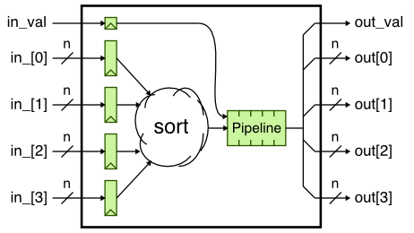
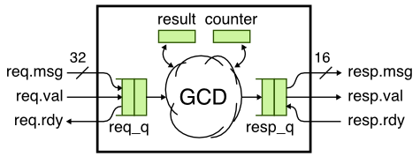

ECE 5745 Tutorial 7: PyMTL CL Modeling
==========================================================================

 - Author: Christopher Batten
 - Date: February 10, 2017

**Table of Contents**

 - Introduction
 - Sort Unit Cycle-Level Model
 - GCD Unit Cycle-Level Model
 - Simple Cache Cycle-Level Model
 - gem5 Cycle-Level Simulator

Introduction
--------------------------------------------------------------------------

Most students are quite familiar with functional-level (FL) and
register-transfer-level (RTL) modeling from ECE 4750, but students are
often less familiar with cycle-level (CL) modeling. Here is a reminder of
the differences between these modeling levels:

 - **Functional-Level:** FL models implement the functionality but not
   the timing of the hardware target. FL models are useful for exploring
   algorithms, performing fast emulation of hardware targets, and
   creating golden models for verification of CL and RTL models. FL
   models can also be used for building sophisticated test harnesses. FL
   models are usually the easiest to construct, but also the least
   accurate with respect to the target hardware.

 - **Cycle-Level:** CL models capture the cycle-approximate behavior of a
   hardware target. CL models will often augment the functional behavior
   with an additional timing model to track the performance of the
   hardware target in cycles. CL models are usually specifically designed
   to enable rapid design-space exploration of cycle-level performance
   across a range of microarchitectural design parameters. CL models
   attempt to strike a balance between accuracy, performance, and
   flexibility.

 - **Register-Transfer-Level:** RTL models are cycle-accurate,
   resource-accurate, and bit-accurate representations of hardware. RTL
   models are built for the purpose of verification and synthesis of
   specific hardware implementations. RTL models can be used to drive EDA
   toolflows for estimating area, energy, and timing. RTL models are
   usually the most tedious to construct, but also the most accurate with
   respect to the target hardware.

The tutorial on PyMTL introduced all three levels of modeling, but we
will review the CL models for the sort unit and GCD unit here. We will
also explore a new CL model for a simple cache, and we will discuss a
sophisticated CL modeling framework used to model complex superscalar
out-of-order processors. Please keep in mind that developing a CL model
is required for lab 1 and may be required for lab 2. While CL modeling is
not required for the project, students may find that CL modeling can
facilitate a much broader initial design-space exploration, and thus
enable students to focus on the most promising designs for RTL
implementation. This tutorial assumes you have already completed the
tutorials on Linux, Git, PyMTL, and Verilog.

The first step is to source the setup script, clone this repository from
GitHub, and define an environment variable to keep track of the top
directory for the project.

```
 % source setup-ece5745.sh
 % mkdir $HOME/ece5745
 % cd $HOME/ece5745
 % git clone git@github.com:cornell-ece5745/ece5745-tut7-pymtl-cl
 % cd ece5745-tut7-pymtl-cl
 % TOPDIR=$PWD
 % mkdir -p $TOPDIR/sim/build
```

Sort Unit Cycle-Level Model
--------------------------------------------------------------------------

We will start by reviewing the sort unit CL model first introduced in the
PyMTL tutorial and shown in the following figure. We immediately sort the
input values in a single cycle, and then we delay sending the response by
several cycles to model the pipeline latency. The key to CL modeling is
to capture the cycle-level behavior (i.e., how long a transaction takes
in cycles) without worrying about the bit-level details or the exact
hardware structures required to implement the desired cycle-level
behavior.



Here is the corresponding code for the sort unit CL model.

```python
class SortUnitCL( Model ):

  def __init__( s, nbits=8, nstages=3 ):

    s.in_val  = InPort (1)
    s.in_     = [ InPort  (nbits) for _ in range(4) ]

    s.out_val = OutPort(1)
    s.out     = [ OutPort (nbits) for _ in range(4) ]

    s.pipe    = deque( [[0,0,0,0,0]]*(nstages-1) )

    @s.tick_cl
    def block():
      s.pipe.append( deepcopy( [s.in_val] + sorted(s.in_) ) )
      data = s.pipe.popleft()
      s.out_val.next = data[0]
      for i, v in enumerate( data[1:] ):
        s.out[i].next = v
```

We can use any Python code we want to implement a CL model. Here we use
Python's built-in `sorted` function to do the actual sorting operation on
the input values. Notice how we use a `deque` to model the pipeline
behavior. Each entry in the `deque` has a valid bit and then the four
sorted values. Also notice how we need to use a `deepcopy` to ensure that
we really do have a copy of the sorted values in the `deque` and not just
a reference. This is very common CL modeling pattern: we do all of the
real work in the first cycle and then delay the response to model the
desired latency. Let's run the sort unit CL tests and then produce a line
trace:

```
 % cd $TOPDIR/sim/build
 % py.test ../tut3_pymtl/sort/SortUnitCL_test.py
 % py.test ../tut3_pymtl/sort/SortUnitCL_test.py -k test[2stage_stream] -s

  2: {04,03,02,01}|
  3: {09,06,07,01}|
  4: {04,08,00,09}|{01,02,03,04}
  5:              |{01,06,07,09}
  6:              |{00,04,08,09}
```

We can see that the first transaction goes into the sort unit on cycle 2
and then comes out of the sort unit on cycle 4. The sort unit CL model is
modeling a two-stage pipeline. Since CL modeling is a higher level
modeling abstraction compared to RTL modeling, it is much easier to
experiment with different parameters. For example, we can easily
experiment with longer latency sort units and analyze the impact the sort
latency has on the full system cycle-level performance.

As another example, let's change our sort unit CL model to sort the four
input values in the reverse order. We can do this quite easily, by just
setting the `reverse` flag when calling Python's built-in `sorted`
function. Here is the updated concurrent block:

```python
    @s.tick_cl
    def block():
      s.pipe.append( deepcopy( [s.in_val] + sorted(s.in_, reverse=True ) ) )
      data = s.pipe.popleft()
      s.out_val.next = data[0]
      for i, v in enumerate( data[1:] ):
        s.out[i].next = v
```

Of course we also need to update the test script to generate reference
outputs where the values are in descending order. Once we make the
changes to the test script, we can see the result as follows:

```
 % cd $TOPDIR/sim/build
 % py.test ../tut3_pymtl/sort/SortUnitCL_test.py -k test[2stage_stream] -s

  2: {04,03,02,01}|
  3: {09,06,07,01}|
  4: {04,08,00,09}|{04,03,02,01}
  5:              |{09,07,06,01}
  6:              |{09,08,04,00}
```

As expected, the output values are now in descending order. The key idea
is that experimenting with different sort orders in an RTL model would
require significantly more work than the quick change shown above. CL
modeling can enable more productive design-space exploration of
cycle-level performance.

GCD Unit Cycle-Level Model
--------------------------------------------------------------------------

We now review the GCD unit CL model also introduced in the PyMTL tutorial
and shown in the following figure. Unlike the sort unit CL model, here we
want to model an iterative microarchitecture. In this case we can simply
do the GCD immediately in a single cycle and then use a counter to wait a
certain number of cycles. The number of cycles to wait should roughly
approximate how long the real hardware will require to calculate the GCD.



Here is the code used to estimate the number of cycles:

```python
def gcd( a, b ):

  ncycles = 0
  while True:
    ncycles += 1
    if a < b:
      a,b = b,a
    elif b != 0:
      a = a - b
    else:
      return (a,ncycles)
```

Essentially, we assume each iteration of the while loop will take one
cycle in an eventual RTL implementation. Take a look at how the CL model
uses adapters to simplify interfacing with the latency insensitive
val/rdy interface.

```python
class GcdUnitCL( Model ):

  def __init__( s ):

    s.req    = InValRdyBundle  ( GcdUnitReqMsg() )
    s.resp   = OutValRdyBundle ( Bits(16)        )

    s.req_q  = InValRdyQueueAdapter  ( s.req  )
    s.resp_q = OutValRdyQueueAdapter ( s.resp )

    s.result  = 0
    s.counter = 0

    @s.tick_cl
    def block():

      # Tick the queue adapters

      s.req_q.xtick()
      s.resp_q.xtick()

      # Handle delay to model the gcd unit latency

      if s.counter > 0:
        s.counter -= 1
        if s.counter == 0:
          s.resp_q.enq( s.result )

      # If we have a new message and the output queue is not full

      elif not s.req_q.empty() and not s.resp_q.full():
        req_msg = s.req_q.deq()
        s.result,s.counter = gcd( req_msg.a, req_msg.b )
```

Instead of having to directly read and write the val/rdy ports, a CL
model can call `deq` (dequeue) and `enq` (enqueue) methods on the
adapters to receive or send messages on val/rdy interfaces. Let's run the
GCD unit CL tests and then produce a line trace:

```
 % cd $TOPDIR/sim/build
 % py.test ../tut3_pymtl/gcd/test/GcdUnitCL_test.py
 % py.test ../tut3_pymtl/gcd/test/GcdUnitCL_test.py -k test[basic_0x0] -s

  2:           >          ().    > .
  3: 000f:0005 > 000f:0005()     >
  4: 0003:0009 > 0003:0009()     >
  5: #         > #        ()     >
  6: #         > #        ()     >
  7: #         > #        ()     >
  8: #         > #        ()     >
  9: #         > #        ()0005 > 0005
 10: 0000:0000 > 0000:0000()     >
 11: #         > #        ()     >
 12: #         > #        ()     >
 13: #         > #        ()     >
 14: #         > #        ()     >
 15: #         > #        ()     >
 16: #         > #        ()0003 > 0003
 17: 001b:000f > 001b:000f()     >
 18: #         > #        ()0000 > 0000
 19: 0015:0031 > 0015:0031()     >
 20: #         > #        ()     >
 21: #         > #        ()     >
 22: #         > #        ()     >
 23: #         > #        ()     >
 24: #         > #        ()     >
 25: #         > #        ()     >
 26: #         > #        ()     >
 27: #         > #        ()     >
 28: #         > #        ()     >
 29: #         > #        ()0003 > 0003
```

Now let's assume we want to experiment with the impact of a hardware
optimization that combines the swap and subtract operation into a single
step. We simply need to change the code that estimates the number of
cycles to something like this:

```python
def gcd( a, b ):

  ncycles = 0
  while True:
    ncycles += 1
    if a < b:
      a,b = b-a,a
    elif b != 0:
      a = a - b
    else:
      return (a,ncycles)
```

Notice how we now also do a subtraction at the same time we swap `a` and
`b`. The resulting line trace is now:

```
 % cd $TOPDIR/sim/build
 % py.test ../tut3_pymtl/gcd/test/GcdUnitCL_test.py -k test[basic_0x0] -s

  2:           >          ().    > .
  3: 000f:0005 > 000f:0005()     >
  4: 0003:0009 > 0003:0009()     >
  5: #         > #        ()     >
  6: #         > #        ()     >
  7: #         > #        ()     >
  8: #         > #        ()     >
  9: #         > #        ()0005 > 0005
 10: 0000:0000 > 0000:0000()     >
 11: #         > #        ()     >
 12: #         > #        ()     >
 13: #         > #        ()     >
 14: #         > #        ()     >
 15: #         > #        ()0003 > 0003
 16: 001b:000f > 001b:000f()     >
 17: #         > #        ()0000 > 0000
 18: 0015:0031 > 0015:0031()     >
 19: #         > #        ()     >
 20: #         > #        ()     >
 21: #         > #        ()     >
 22: #         > #        ()     >
 23: #         > #        ()     >
 24: #         > #        ()     >
 25: #         > #        ()     >
 26: #         > #        ()0003 > 0003
```

Our model now suggests the GCD unit will finish four transactions in 26
cycles instead of finishing on four transactions in 29 cycles. Conducting
a similar experiment in an RTL model would require significant changes to
the datapath and control unit, while experimenting with such cycle-level
behavior in a CL model is much easier.

Simple Cache Cycle-Level Model
--------------------------------------------------------------------------

We now examine a more involved CL model for a specific target cache
design. The target cache includes `cachereq`/`cacheresp` interfaces for
the unit that wants to use the cache, and `memreq`/`memresp` interfaces
for connecting the cache to main memory. We will be modeling a relatively
simple cache that is direct-mapped, write-through, and no-write-allocate.
The cache will have eight single-word cache lines and will only support
full-word cache requests. You can run all of the tests for the cache CL
model like this:

```
 % cd $TOPDIR/sim/build
 % py.test ../tut7_pymtl_cl
```

The sequential concurrent block for modeling the cycle-level behavior of
the cache is shown below.

```python
    @s.tick_cl
    def tick():

      # Tick adapters

      s.cachereq_q.xtick()
      s.cacheresp_q.xtick()

      s.memreq_q.xtick()
      s.memresp_q.xtick()

      # Some constants to simplify the code

      s.READ  = s.cache_ifc_dtypes.req.TYPE_READ
      s.WRITE = s.cache_ifc_dtypes.req.TYPE_WRITE

      # If we are not waiting for a memory response ...

      if not s.wait_bit and not s.cachereq_q.empty() \
                        and not s.memreq_q.full() \
                        and not s.cacheresp_q.full():

        cachereq = s.cachereq_q.deq()

        if   cachereq.type_ == s.WRITE : s.process_cachereq_write( cachereq )
        elif cachereq.type_ == s.READ  : s.process_cachereq_read ( cachereq )
        else                           : assert False

      # If we are waiting for a memory response ...

      if s.wait_bit and not s.memresp_q.empty() \
                    and not s.cacheresp_q.full():

        memresp = s.memresp_q.deq()

        if   memresp.type_ == s.WRITE : s.process_memresp_write( memresp )
        elif memresp.type_ == s.READ  : s.process_memresp_read ( memresp )
        else                          : assert False
```

As with the GCD unit CL model, we use adapters on all four interfaces to
simplify interacting with the latency insensitive val/rdy microprotocol.
There are two primary parts to this concurrent block, and which part we
execute depends on the `wait_bit`. The `wait_bit` is true when we are
waiting for a memory response, and the `wait_bit` is false otherwise. If
we are not waiting for a memory response, then we check to see if there
is a new cache request (i.e., is the adapter for the `cachereq` interface
not empty?) but we also make sure that the memory request and cache
response interfaces are available. Note that this is somewhat
conservative; not all transactions need both the memory request and the
cache response (e.g., cache read hits do not need to send a memory
request), but we simplify our logic ensuring that all potentially
required resources are available before starting to process a cache
request. Based on the type of the cache request, we dispatch to one of
two member functions. If we are waiting for a memory response, we again
make sure that all potentially required resources (i.e., the cache
response interface) are available before starting to process the memory
response. Based on the type of the memory response we dispatch to one of
two member functions. Take a closer look at how these four member
functions are implemented. Note how CL modeling is more of a software
engineering effort to model hardware as compared to RTL modeling which is
more of a hardware engineering effort to implement hardware. We can run a
test and view a line trace for the cache CL model like this:

```
 % cd $TOPDIR/sim/build
 % py.test ../tut7_pymtl_cl -k test_1port[basic] -s

  #  cachereq                  set 0         set 7   memreq                   memresp           cacheresp
  2:                         (       | ... |       )                        ()                  .
  3: wr:00:00001000:deadbeef (       | ... |       )                        ()
  4: rd:01:00001000:         (       | ... |       ) wr:00:00001000:deadbeef()
  5: .                       (       | ... |       )                        ()wr:00:0:
  6: .                       (       | ... |       )                        ()                  wr:00:0:
  7:                         (       | ... |       ) rd:01:00001000:        ()
  8:                         (       | ... |       )                        ()rd:01:0:deadbeef
  9:                         (0000080| ... |       )                        ()                  rd:01:0:deadbeef
```

We have replaced some of the line trace with `...` to simplify the line
trace for this document. We have also added some extra annotation to
label the various columns. The line trace shows cache request/response,
memory request/response, as well as the tags for all eight cache lines.
The first write cache request is passed through to main memory because
this is a write-through cache. Since the cache is no-write-allocate, the
write cache request does not update the cache state, and the read cache
request misses. The read cache request eventually will update the cache
state with the data returned from main memory (notice how the tag 000080
is in set 0 at the beginning of cycle 9.

The `basic_hit` test includes a series of reads to the same cache line
and thus illustrates cache hits:

```
 % cd $TOPDIR/sim/build
 % py.test ../tut7_pymtl_cl -k test_1port[basic_hit] -s

  #  cachereq                  set 0         memreq                        memresp           cacheresp
  2:                         (       | ... )                        (     )                  .
  3: wr:00:00001000:deadbeef (       | ... )                        (     )
  4: rd:01:00001000:         (       | ... ) wr:00:00001000:deadbeef(     )
  5: #                       (       | ... )                        (*    )
  6: #                       (       | ... )                        ( *   )
  7: #                       (       | ... )                        (  *  )
  8: #                       (       | ... )                        (   * )
  9: #                       (       | ... )                        (    *)
 10: #                       (       | ... )                        (     )wr:00:0:
 11: #                       (       | ... )                        (     )                  wr:00:0:
 12: wr:02:00001000:deadbeef (       | ... ) rd:01:00001000:        (     )
 13: #                       (       | ... )                        (*    )
 14: #                       (       | ... )                        ( *   )
 15: #                       (       | ... )                        (  *  )
 16: #                       (       | ... )                        (   * )
 17: #                       (       | ... )                        (    *)
 18: #                       (       | ... )                        (     )rd:01:0:deadbeef
 19: #                       (0000080| ... )                        (     )                  rd:01:0:deadbeef
 20: rd:03:00001000:         (0000080| ... ) wr:02:00001000:deadbeef(     )
 21: #                       (0000080| ... )                        (*    )
 22: #                       (0000080| ... )                        ( *   )
 23: #                       (0000080| ... )                        (  *  )
 24: #                       (0000080| ... )                        (   * )
 25: #                       (0000080| ... )                        (    *)
 26: #                       (0000080| ... )                        (     )wr:02:0:
 27: #                       (0000080| ... )                        (     )                  wr:02:0:
 28: rd:04:00001000:         (0000080| ... )                        (     )                  rd:03:0:deadbeef
 29: rd:05:00001000:         (0000080| ... )                        (     )                  rd:04:0:deadbeef
 30: rd:06:00001000:         (0000080| ... )                        (     )                  rd:05:0:deadbeef
 31:                         (0000080| ... )                        (     )                  rd:06:0:deadbeef
```

Notice how this test uses a test memory with a latency of five cycles.
The later reads hit in the cache. They do not require memory requests and
are returned with a single-cycle hit latency. After looking at the code,
it should hopefully be clear how it would be possible to modify the cache
CL model to flexibly model a variety of caches with different cache line
sizes, cache capacities, write policies, and replacement policies.
Creating these kind of highly parameterized models is much easier when
working with CL modeling as as compared to RTL modeling.

Let's modify our cache CL model to use a write-allocate policy. We simply
need to change the `process_cachereq_write` member function to update the
cache state on a write miss. The required changes are shown below:

```python
  def process_cachereq_write( s, cachereq ):

    # Check to see if we hit or miss in cache

    tag = cachereq.addr[5:32]
    idx = cachereq.addr[2:5]
    hit = s.cache[idx].valid and (s.cache[idx].tag == tag)

    # On a cache hit, update the corresponding data

    if hit:
      s.cache[idx].data = cachereq.data

    # On a cache miss, update the valid bit, tag, and data

    if not hit:

      cache_line = CacheLine()
      cache_line.valid = True
      cache_line.tag   = tag
      cache_line.data  = cachereq.data

      s.cache[idx] = cache_line

    # Always send write request to main memory

    s.memreq_q.enq( cachereq )

    # Set wait bit so cache knows to wait for response message

    s.wait_bit = True
```

If we rerun the `basic_hit` test we should see the data being allocated
in the cache on the very first write cache request.

```
 % cd $TOPDIR/sim/build
 % py.test ../tut7_pymtl_cl -k test_1port[basic_hit] -s

  #  cachereq                  set 0         memreq                        memresp           cacheresp
  2:                         (       | ... )                        (     )                  .
  3: wr:00:00001000:deadbeef (       | ... )                        (     )
  4: rd:01:00001000:         (0000080| ... ) wr:00:00001000:deadbeef(     )
  5: #                       (0000080| ... )                        (*    )
  6: #                       (0000080| ... )                        ( *   )
  7: #                       (0000080| ... )                        (  *  )
  8: #                       (0000080| ... )                        (   * )
  9: #                       (0000080| ... )                        (    *)
 10: #                       (0000080| ... )                        (     )wr:00:0:
 11: #                       (0000080| ... )                        (     )                  wr:00:0:
 12: wr:02:00001000:deadbeef (0000080| ... )                        (     )                  rd:01:0:deadbeef
 13: rd:03:00001000:         (0000080| ... ) wr:02:00001000:deadbeef(     )
 14: #                       (0000080| ... )                        (*    )
 15: #                       (0000080| ... )                        ( *   )
 16: #                       (0000080| ... )                        (  *  )
 17: #                       (0000080| ... )                        (   * )
 18: #                       (0000080| ... )                        (    *)
 19: #                       (0000080| ... )                        (     )wr:02:0:
 20: #                       (0000080| ... )                        (     )                  wr:02:0:
 21: rd:04:00001000:         (0000080| ... )                        (     )                  rd:03:0:deadbeef
 22: rd:05:00001000:         (0000080| ... )                        (     )                  rd:04:0:deadbeef
 23: rd:06:00001000:         (0000080| ... )                        (     )                  rd:05:0:deadbeef
 24:                         (0000080| ... )                        (     )                  rd:06:0:deadbeef
```

Compare this line trace to the previous line trace and notice how the
first read cache request now hits in the cache. Experimenting with
changing the write policy in an RTL model would likely require
significant changes to the datapath and the control unit, while this
experiment is relatively simple to implement in a CL model. If we were
evaluating a full system where this cache was just one component, we
could use our CL model to help understand the system-level performance
impact of no-write-allocate vs. write-allocate, and this would guide us
to a promising design before we even write one line of RTL code.

As another example, let's assume we wish to model a cache with a two
cycle instead of single cycle hit latency. All we need to do is buffer
the cache response for one extra cycle. First, we add this buffer in the
constructor of our cache CL model:

```python
    # Extra buffering to model two-cycle hit latency

    s.pipebuf   = None
```

Now we need to modify the `process_cachereq_read` member function as
follows to place the cache response in this new buffer instead of
immediately sending the cache response out the `cacheresp` interface.

```python
  def process_cachereq_read( s, cachereq ):

    # Check to see if we hit or miss in cache

    tag = cachereq.addr[5:32]
    idx = cachereq.addr[2:5]
    hit = s.cache[idx].valid and (s.cache[idx].tag == tag)

    # On a cache hit, return data from cache

    if hit:

      cacheresp = s.cache_ifc_dtypes.resp
      cacheresp.type_  = s.cache_ifc_dtypes.resp.TYPE_READ
      cacheresp.opaque = cachereq.opaque
      cacheresp.len    = cachereq.len
      cacheresp.data   = s.cache[idx].data

      s.pipebuf = cacheresp

    # On a cache miss, send out refill request to main memory

    if not hit:

      s.memreq_q.enq( cachereq )

      # Set wait bit so cache knows to wait for response message.

      s.wait_bit  = True
      s.wait_addr = cachereq.addr
```

Finally, in the `s.tick_cl` block we need to copy the cache response from
the `pipebuf` and send it out the `cacheresp` interface. Try adding this
code at the end of the `s.tick_cl` block:

```python
      if s.pipebuf:
        s.cacheresp_q.enq( s.pipebuf )
        s.pipebuf = None
```

Every cycle we check to see if there is anything in the `s.pipebuf`
(i.e., is the `s.pipebuf` not `None`) and if there is indeed something
waiting in the `s.pipebuf` we send it out the `cacheresp` interface. We
clear the `s.pipebuf` so we know that we are done with this response. If
you rerun the `basic_hit` test, the end of the line trace should look
like this:

```
 % cd $TOPDIR/sim/build
 % py.test ../tut7_pymtl_cl -k test_1port[basic_hit] -s

  #  cachereq                  set 0         memreq                        memresp           cacheresp
 21: rd:04:00001000:         (0000080| ... )                        (     )                  rd:03:0:deadbeef
 22: rd:05:00001000:         (0000080| ... )                        (     )                  rd:04:0:deadbeef
 23: rd:06:00001000:         (0000080| ... )                        (     )                  rd:05:0:deadbeef
 24:                         (0000080| ... )                        (     )                  rd:06:0:deadbeef
```

Nothing has changed! Read hits still take a single cycle. The problem is
that the `process_cachereq_read` member function is called first in the
`s.tick_cl` block, we write the `s.pipebuf`, and then at the end of the
`s.tick_cl` block we send the cache response out the `cacheresp`
interface. Essentially the `s.pipebuf` is not modeling a register but is
instead modeling a wire. To model a register we often need to do the work
"after the register" first, and then we model the work "before the
register" second. In other words, to model a pipeline in a single
`s.tick_cl` block, we need to model the stages in the _reverse_ order. This
is a common pattern in CL modeling. We need to place the code that sends
the cache response out the `cacheresp` interface at the _beginning_ of
the `s.tick_cl` block (well after the calls to `xtick` but before we
process any cache requests or memory responses). With this change you
should see the following line trace:

```
 % cd $TOPDIR/sim/build
 % py.test ../tut7_pymtl_cl -k test_1port[basic_hit] -s

  #  cachereq                  set 0         memreq                        memresp           cacheresp
 22: rd:04:00001000:         (0000080| ... )                        (     )
 23: #                       (0000080| ... )                        (     )                  rd:03:0:deadbeef
 24: rd:05:00001000:         (0000080| ... )                        (     )
 25: #                       (0000080| ... )                        (     )                  rd:04:0:deadbeef
 26: rd:06:00001000:         (0000080| ... )                        (     )
 27: .                       (0000080| ... )                        (     )                  rd:05:0:deadbeef
 28:                         (0000080| ... )                        (     )
 29:                         (0000080| ... )                        (     )                  rd:06:0:deadbeef
```

This is still not correct. Now a cache read hit is taking three cycles
and it looks like there is some extra occupancy instead of the
full-throughput pipeline behavior we were hoping for. The problem now is
that our `s.tick_cl` block is still checking to see if the `cacheresp`
interface is ready; we should really be checking to see if the
`s.pipebuf` is empty or not. The final correct `s.tick_cl` implementation
should look like this:

```python
    @s.tick_cl
    def tick():

      # Tick adapters

      s.cachereq_q.xtick()
      s.cacheresp_q.xtick()

      s.memreq_q.xtick()
      s.memresp_q.xtick()

      # Some constants to simplify the code

      s.READ  = s.cache_ifc_dtypes.req.TYPE_READ
      s.WRITE = s.cache_ifc_dtypes.req.TYPE_WRITE

      # Model an extra cycle of latency for read hits

      if s.pipebuf:
        s.cacheresp_q.enq( s.pipebuf )
        s.pipebuf = None

      # If we are not waiting for a memory response ...
      # Notice that we check s.pipebuf not s.cacheresp_q.full()

      if not s.wait_bit and not s.cachereq_q.empty() \
                        and not s.memreq_q.full() \
                        and not s.pipebuf:

        cachereq = s.cachereq_q.deq()

        if   cachereq.type_ == s.WRITE : s.process_cachereq_write( cachereq )
        elif cachereq.type_ == s.READ  : s.process_cachereq_read ( cachereq )
        else                           : assert False

      # If we are waiting for a memory response ...

      if s.wait_bit and not s.memresp_q.empty() \
                    and not s.pipebuf:

        memresp = s.memresp_q.deq()

        if   memresp.type_ == s.WRITE : s.process_memresp_write( memresp )
        elif memresp.type_ == s.READ  : s.process_memresp_read ( memresp )
        else                          : assert False
```

And the resulting line trace should look like this:

```
 % cd $TOPDIR/sim/build
 % py.test ../tut7_pymtl_cl -k test_1port[basic_hit] -s

  #  cachereq                  set 0         memreq                        memresp           cacheresp
 21: rd:04:00001000:         (0000080| ... )                        (     )
 22: rd:05:00001000:         (0000080| ... )                        (     )                  rd:03:0:deadbeef
 23: rd:06:00001000:         (0000080| ... )                        (     )                  rd:04:0:deadbeef
 24:                         (0000080| ... )                        (     )                  rd:05:0:deadbeef
 25:                         (0000080| ... )                        (     )                  rd:06:0:deadbeef
```

This is our desired cycle-level behavior. Cache read hits have a two
cycle latency, yet we can still sustain full throughput. One of the key
take-aways is that developing a CL model which does a reasonable job of
modeling the cycle-level behavior can be challenging and often requires
iteratively experimenting with small performance-focused test cases.

gem5 Cycle-Level Simulator
--------------------------------------------------------------------------

Most computer architects in industry and academia spend far more time
developing CL models instead of RTL models. Computer architects will
often start with a previously developed CL model and then experiment with
new computer architecture ideas by modifying this CL model. A great
example is the [gem5 CL simulator](http://www.gem5.org). This simulator
is written in C++ and includes detailed CL models for processors,
memories, and networks. It includes complex processor CL models which
model superscalar execution, out-of-order execution, register renaming,
memory disambiguation, branch prediction, and speculative execution.

Here is an example of an assembly version of the vector-vector add
microbenchmark running on the gem5 quad-issue out-of-order processor. The
output from the simulator is post-processed to create a kind of pipeline
view.

```
 [fdn.ic...............r....................] 0x00808020.0 lw r6, 0(r2)
 [fdn.pic..............r....................] 0x00808024.0 lw r7, 0(r3)
 [fdn.p..............ic.r...................] 0x00808028.0 addu r8, r6, r7
 [fdn.p...............ic.r..................] 0x0080802c.0 sw r8, 0(r4)
 [.fdn.ic................r..................] 0x00808030.0 addiu r2, r2, 4
 [.fdn.ic................r..................] 0x00808034.0 addiu r3, r3, 4
 [.fdn.ic................r..................] 0x00808038.0 addiu r4, r4, 4
 [.fdn..ic................r.................] 0x0080803c.0 addiu r5, r5, 1
 [..fdn..ic...............r.................] 0x00808040.0 bne r5, r1, 0x808020
 [...f..dn.ic.............r.................] 0x00808020.0 lw r6, 0(r2)
 [...f..dn.pic............r.................] 0x00808024.0 lw r7, 0(r3)
 [...f..dn.p.........ic....r................] 0x00808028.0 addu r8, r6, r7
 [...f..dn.p...........ic..r................] 0x0080802c.0 sw r8, 0(r4)
 [.......fdn.ic............r................] 0x00808030.0 addiu r2, r2, 4
 [.......fdn.ic............r................] 0x00808034.0 addiu r3, r3, 4
 [.......fdn.ic.............r...............] 0x00808038.0 addiu r4, r4, 4
 [.......fdn.ic.............r...............] 0x0080803c.0 addiu r5, r5, 1
 [........fdn.pic...........r...............] 0x00808040.0 bne r5, r1, 0x808020
```

Here is the legend:

 - `f` = fetch stage, `d` = decode stage, `n` = rename stage
 - `.` after n is always an extra "ROB allocation" stage
 - `p` = "dispatch", we think this is similar to how we show an i when an
       instruction goes into the IQ
 - `c` = complete stage, this seems to be the same as an X stage
 - `i` = issue stage, for long latency operations the "latency" happens
       while the instruction is in the issue queue and then you see the `i`
       at the end right before the instruction is complete. so you will
       not see more than one `i` or `c` for a long latency instruction
 - `.` after c stage, we think this is similar to our W stage
 - `r` = retire stage, this is similar to our C stage

Here is the above pipeline view carefully transformed into a pipeline
diagram similar in spirit to what we learned in ECE 4750.

```
                  0 1 2 3 4 5 6 7 8 9 0 1 2 3 4 5 6 7 8 9 0 1 2 3 4 5 6
 ----------------------------------------------------------------------
 lw r6, 0(r2)     F D N R I X q . . . . . . . . . . M W r . C           lw -> LSQ, D$ miss, resp on cyc 17 in M
 lw r7, 0(r3)     F D N R i I X q . . . . . . . . . . M W r C           lw -> LSQ, D$ miss, resp on cyc 18 in M
 addu r8, r6, r7  F D N R i . . . . . . . . . . . . . . I X W C         RAW hazard, addu waits in IQ for lw insts
 sw r8, 0(r4)     F D N R i . . . . . . . . . . . . . . . I X W C       RAW hazard, sw waits in IQ for addu
 addiu r2, r2, 4    F D N R I X W r . . . . . . . . . . . . . . C
 addiu r3, r3, 4    F D N R I X W r . . . . . . . . . . . . . . C
 addiu r4, r4, 4    F D N R I X W r . . . . . . . . . . . . . . C
 addiu r5, r5, 1    F D N R i I X W r . . . . . . . . . . . . . . C     struct hazard, only 4 issue ports
 bne r5, r1, loop     F D N R i I X W r . . . . . . . . . . . . . C     RAW hazard, bne waits in IQ for addiu r5
 ----------------------------------------------------------------------
 lw r6, 0(r2)           F D D D N R I X q . . . . . M W r . . . . C     struct hazard, lw waits since LSQ is full
 lw r7, 0(r3)           F D D D N R i I X q . . . . . M W r . . . C     struct hazard, lw waits since LSQ is full
 addu r8, r6, r7        F D D D N R i . . . . . . . . . I X W r . . C   above struct hazard -> whole bundle stalls
 sw r8, 0(r4)           F D D D N R i . . . . . . . . . . . I X W r C   above struct hazard -> whole bundle stalls
 addiu r2, r2, 4          F F F F D N R I X W r . . . . . . . . . . C   stalls because prev bundle stallling in D
 addiu r3, r3, 4          F F F F D N R I X W r . . . . . . . . . . C   stalls because prev bundle stallling in D
 addiu r4, r4, 4          F F F F D N R I X W r . . . . . . . . . . . C stalls because prev bundle stallling in D
 addiu r5, r5, 1          F F F F D N R I X W r . . . . . . . . . . . C stalls because prev bundle stallling in D
 bne r5, r1, loop                 F D N R i I X W r . . . . . . . . . C why does bne wait in IQ one cycle?
```

And here is the legend:

 - `F` : fetch
 - `D` : decode
 - `N` : rename
 - `R` : ROB allocation
 - `I` : issue
 - `X` : execute for arithmetic operations
 - `M` : memory access completion for ld/st operations
 - `W` : writeback
 - `C` : commit
 - `i` : waiting in issue queue
 - `r` : waiting in ROB
 - `q` : waiting in LSQ for memory response to come back

From the pipeline diagram we can see how the CL model is capturing many
of the complex features we learned in ECE 4750. It is faithfully tracking
RAW hazards and structural hazards, and it is modeling cache effects,
aggressive branch prediction, and fully out-of-order load/store issue.
Implementing this kind of processor in RTL would require a tremendous
design team and would never be as flexible and extensible as the gem5 CL
simulator, which is why architects usually prefer CL models when doing
early design-space exploration. Of course, the challenge with a CL model
is it is possible to model completely unrealistic hardware, and it is
very challenging to estimate the area, energy, and timing of a specific
design. So in this course, we argue for a balanced approach that uses a
mix of FL, CL, and RTL modeling. If you think using the gem5 cycle-level
simulator would be useful in your project, let the instructors know and
we can look into installing it on `ecelinux`.

